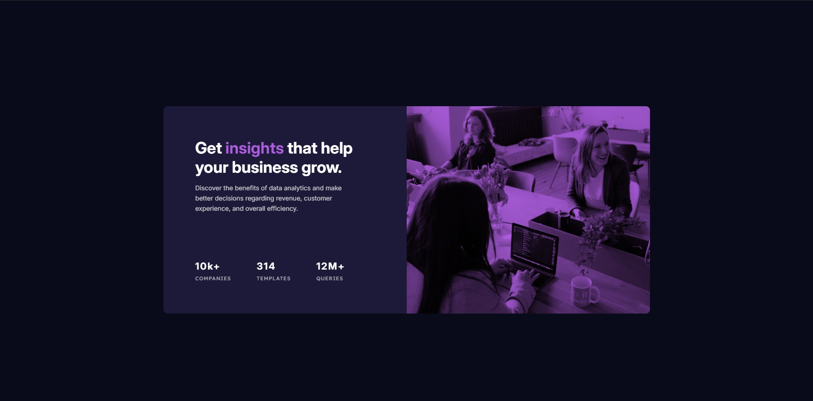

# Frontend Mentor - Stats preview card component solution

This is my solution to the [Stats preview card component challenge on Frontend Mentor](https://www.frontendmentor.io/challenges/stats-preview-card-component-8JqbgoU62). Frontend Mentor challenges help you improve your coding skills by building realistic projects.

## Table of contents

- [Overview](#overview)
  - [The challenge](#the-challenge)
  - [Screenshot](#screenshot)
  - [Links](#links)
- [My process](#my-process)
  - [Built with](#built-with)
  - [What I learned](#what-i-learned)
  - [Continued development](#continued-development)

## Overview

### The challenge

Users should be able to:

- View the optimal layout depending on their device's screen size

### Screenshot



### Links

- Solution URL: [Solution URL](https://www.frontendmentor.io/solutions/stats-preview-card-component-MpOGdX6CSh)
- Live Site URL: [Live site URL](https://juanfeoru.github.io/stats-preview-card-component/)

## My process

### Built with

- Semantic HTML5 markup
- CSS custom properties (variables)
- Flexbox
- Mobile-first workflow
- BEM naming convention
- Responsive images with `<picture>`
- CSS blend modes for image overlay

### What I learned

- How to use the `<picture>` element to serve different images for mobile and desktop, improving responsiveness.
- How to apply a color overlay to images using a CSS pseudo-element and `mix-blend-mode`.
- How to maintain image proportions with `aspect-ratio` and `object-fit: cover` to ensure images always fit their container.
- How to organize CSS using the BEM methodology for better maintainability and scalability.

```html
<picture>
  <source
    srcset="./images/image-header-desktop.jpg"
    media="(min-width: 620px)"
  />
  
</picture>
```

```css
.card__image::after {
  content: "";
  position: absolute;
  inset: 0;
  background: var(--purple-500);
  mix-blend-mode: multiply;
  pointer-events: none;
}
```

### Continued development

- Improve accessibility (more descriptive alt text, ARIA roles if needed).
- Explore advanced responsive design techniques, such as using `clamp()` for font sizes and paddings.
- Optimize images further by using modern formats like WebP and lazy loading.
